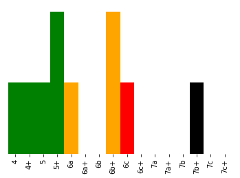
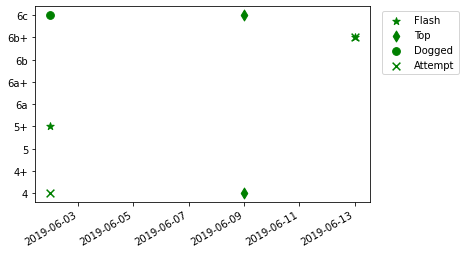

# Climbing
This repo covers a few classes that describe rock-climbing.  It was created as an exercise in package development.

[Location on PyPi](https://pypi.org/project/pgs-climbing/)
[Location on Github](https://github.com/paul-stubley/Climbing)

## Quickstart
It is available to install using pip, e.g. for python3 use:

`python3 -m pip install pgs_climbing`

And can then be used by importing into your python files:

`from pgs_climbing import Crag, Route, Climber, GRADES_LIST`

## Contents
The classes are currently:

- Crag - A class to hold information about each climbing area, the routes it contains and its location.
- Route - A class to hold information about a particular route - its name, grade, height etc.

- Climber - A class to hold information about a climber, the routes they have attempted/climbed and when.

The class descriptions can be found in the `climbing_package/pgs_climbing` directory

## Example output

There is a jupyter notebook in ```examples/``` if you want to see it in action

It currently has two basic visual summary methods, one on the crag class summarising the routes at that crag:



and one on the climber class, showing their progress over time: 




